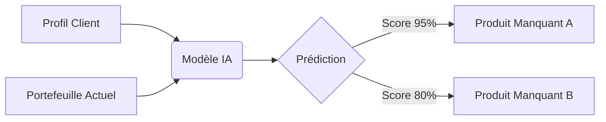
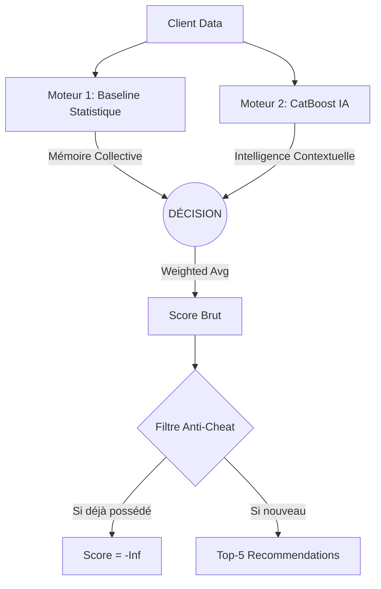

# Système de Recommandation d'Assurance (Zimnat)

**Une approche Hybride (Modèle de Machine Learning + Règles Statistiques) pour l'optimisation du Cross-Sell.**


---

## 1. Contexte Métier & Enjeux

### Le Client : Zimnat Group 🇿🇼
Zimnat est un acteur majeur des services financiers au Zimbabwe, structuré autour de plusieurs pôles stratégiques :
*   **Assurance** : Vie (Life), Non-Vie (Motor, Home), Santé.
*   **Finance** : Microfinance, Gestion de Patrimoine (Wealth Management).

### Le Besoin Business (Pourquoi ce projet ?)
Dans l'assurance, la relation client est précieuse. Contacter un client pour lui proposer un produit qu'il possède déjà est une erreur coûteuse (perte de temps agent, frustration client).
L'objectif est de transformer la démarche commerciale : **passer du "Mass Marketing" au "Precision Marketing".**

**Les Enjeux Stratégiques :**
1.  **Augmentation du Cross-Sell** : Un client multi-équipé (Auto + Maison + Vie) est plus fidèle et plus rentable (LTV élevée).
2.  **Efficacité Opérationnelle** : Fournir aux agents une liste de "Warm Leads" (clients ayant un besoin probabiliste fort) plutôt que d'appeler au hasard.
3.  **Réduction du Churn** : Proposer le bon produit au bon moment renforce la confiance.

---

## 2. Le Challenge Technique (Zindi)

Ce projet répond au challenge **"Zimnat Insurance Recommendation"** (exposé sur Zindi).

### La Problématique "Snapshot"
Contrairement aux sites e-commerce classiques (Amazon/Netflix), nous n'avons pas l'historique temporel des clics ou des achats.
Nous disposons uniquement d'une **photo à l'instant T** du portefeuille client.
> *Question : "Vu que ce client a Profil X et possède déjà {A, B}, quel est le produit C qu'il est le plus susceptible de vouloir ?"*

### La Solution : Compléter le Puzzle
C'est un problème de **Pattern Completion**. Le modèle doit apprendre la "grammaire" des produits d'assurance (ex: "On prend rarement une Assurance Retraite avant d'avoir une Assurance Vie").



---

## 3. La Solution : Moteur Hybride ("Dual Engine")

Pour garantir à la fois la performance et la fiabilité, nous avons conçu une architecture à deux têtes.

### Architecture du Système



### Moteur 1 : La Mémoire (Baseline Statistique)
*   **Approche** : Probabilités Conditionnelles (Bayésien).
*   **Logique** : *"80% des clients qui ont une assurance Auto ont aussi une assurance Habitation."*
*   **Rôle** : Assure la cohérence de base et la robustesse (ne se trompe jamais sur les grandes tendances).

### Moteur 2 : L'Intelligence (CatBoost)
*   **Approche** : Gradient Boosting sur Arbres de Décision.
*   **Logique** : *"Ce client est jeune, vit en zone urbaine, et a un revenu élevé -> Il a besoin d'une protection Électronique, même si ce n'est pas le produit le plus populaire."*
*   **Rôle** : Apporte la personnalisation fine et détecte les signaux faibles.

### Sécurité "Anti-Cheat"
Une règle métier stricte vient nettoyer la sortie : **Le système ne recommandera JAMAIS un produit déjà détenu.** Cela garantit zéro faux pas commercial.

---

## 4. L'Application Streamlit : Guide des Modules

L'outil est livré sous forme d'une application Web interactive (`app/Home.py`) divisée en 5 modules, conçus pour différents utilisateurs.

### 1. Home (Tableau de Bord Exécutif)
*   **Pour qui ?** : Management / Parties Prenantes.
*   **Quoi ?** : Vue d'ensemble de la performance (KPIs comme le Hit@1), contexte du projet, et proposition de valeur.

### 2. Business Insights (Stratégie)
*   **Pour qui ?** : Analystes Marketing.
*   **Fonction** : Comprendre le marché.
    *   *Saisonnalité* : Quand vend-on le plus ?
    *   *Segmentation* : Qui sont nos clients VIP ("Sleeping Giants") ?
    *   *Performance* : Quelle branche vend le mieux ?

### 3. Client Inspector (Terrain)
*   **Pour qui ?** : Agents d'Assurance.
*   **Fonction** : Préparer un rendez-vous client.
    *   Entrez un ID client -> Obtenez son Top-3 produits.
    *   Comprenez **POURQUOI** (ex: "Recommandé car Age > 40 et Occupation = Enseignant").

### 4. Market Simulator (Laboratoire)
*   **Pour qui ?** : Product Owners.
*   **Fonction** : Tester des hypothèses ("What-If").
    *   *"Si notre clientèle rajeunit de 10 ans, quels produits vont monter ?"*
    *   Permet d'ajuster l'offre avant même de lancer une campagne.

### 5. Methodology (Transparence)
*   **Pour qui ?** : Data Scientists / Auditeurs.
*   **Fonction** : Documentation technique.
    *   Détail du protocole "Hide and Seek" (Leave-One-Out) utilisé pour valider le modèle sans données futures.

---

## 5. Installation & Démarrage

### Pré-requis Technique
*   Python 3.8+
*   Pip

### Installation Rapide
```bash
# 1. Cloner le dépôt
git clone <url-du-repo>
cd insurance_recommender

# 2. Installer les dépendances
pip install -r requirements.txt
```

### Lancer l'Application
```bash
streamlit run app/Home.py
```
Une fois lancé, votre navigateur s'ouvrira automatiquement sur : `http://localhost:8501`.

---

**Auteur** : Goua Beedi

