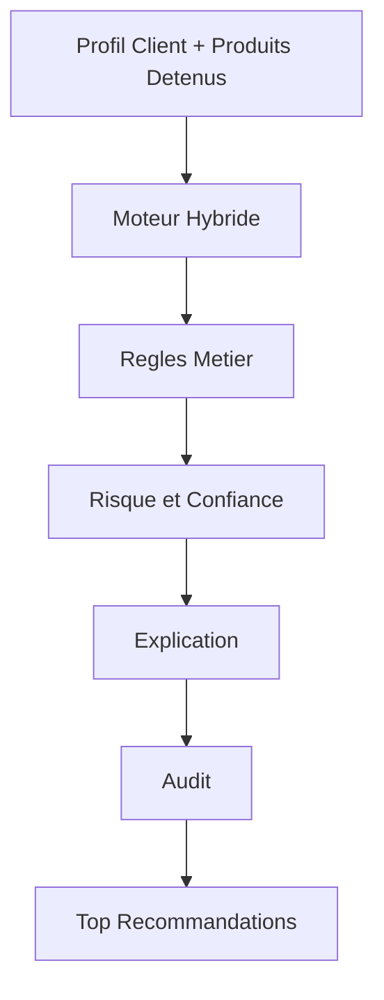

# Insurance DecisionFlow AI

Systeme d'aide a la decision en assurance pour recommander le bon produit au bon client.


## Lecture rapide

### Contexte metier et enjeux

Dans l'assurance, une mauvaise recommandation coute cher: perte de temps pour les agents, opportunites ratees de cross-sell, frustration client et baisse de confiance dans l'outil.

Ce projet repond a un besoin concret: passer d'une approche commerciale generale a une approche ciblee, explicable et pilotable.

Notre ambition est simple: aider les equipes a savoir qui contacter, quel produit proposer et avec quel niveau de confiance.

## Pourquoi explorer ce projet

Ce repo montre une approche complete, de bout en bout:
- moteur hybride (statistique + IA)
- regles metier strictes
- explicabilite
- audit et tracabilite
- interface Streamlit orientee usage terrain

Si vous cherchez un projet ML applique au metier, avec une logique produit claire, vous etes au bon endroit.

### Proposition de valeur

Le systeme prend le profil client et les produits deja detenus, puis il renvoie un top de recommandations, un niveau de confiance, une explication et une trace d'audit.

### Intuition produit

L'idee est de completer intelligemment le portefeuille client.
Par exemple, si un client a deja certains produits et un profil compatible, le systeme estime quels produits manquants ont le plus de sens.


```mermaid
graph LR
    A[Profil Client] --> M(Modele IA)
    B[Produits Deja Detenus] --> M
    M --> P{Prediction}
    P -->|Score eleve| R1[Produit recommande A]
    P -->|Score moyen| R2[Produit recommande B]
```

### Fonctionnement en 5 etapes
1. On lit le profil client et ses produits actuels.
2. Le moteur hybride calcule les scores (statistique + IA).
3. Les regles metier filtrent les produits non valides.
4. Le systeme calcule un niveau de risque et de confiance.
5. Le systeme retourne recommandations, explications et audit.

### Valeur business 

Dans l'assurance, recommander un produit deja possede est une erreur. Ce projet aide a augmenter le cross-sell, reduire les erreurs de recommandation et ameliorer l'efficacite des agents.

### Approche technique

Le moteur combine:
- baseline statistique
- modele IA CatBoost
- regles metier strictes

Regle cle:
- ne jamais recommander un produit deja possede

### Garanties 

- Regles metier appliquees apres le modele
- Explications basees sur des donnees structurees
- Audit pour tracer les decisions
- Architecture modulaire facile a tester

### Schema principal


```mermaid
flowchart TB
    Input[Profil Client + Produits Detenus] --> Hybrid[Moteur Hybride]
    Hybrid --> Rules[Regles Metier]
    Rules --> Risk[Risque et Confiance]
    Risk --> Explain[Explication]
    Explain --> Audit[Audit]
    Audit --> Output[Top Recommandations]
```

## Objectif 

Passer d'une approche generale a une approche ciblee:
- bon produit
- bon client
- bon moment

## Ce que contient le repo

- App Streamlit (inspection client, simulation, evaluation)
- Moteur de recommandation hybride
- Couche policy/risk/explanation/audit
- Couche agents IA optionnelle
- Modules d'evaluation

## A qui sert ce projet

- Equipes metier: comprendre les enjeux et la valeur business
- Equipes data: ameliorer le modele et l'evaluation
- Equipes produit: piloter les regles et la qualite des recommandations


## Documentation detaillee

- Guide : [docs/guide_detaille.md](docs/guide_detaille.md)

## Lancer le projet

Prerequis:
- Python 3.10+
- pip

Installation:

```bash
git clone <repo_url>
cd Insurance_product_recommender
pip install -r requirements.txt
```

```bash
streamlit run app/Home.py
```

## Auteur

Goua Beedi
