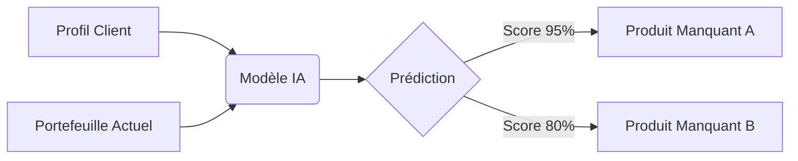
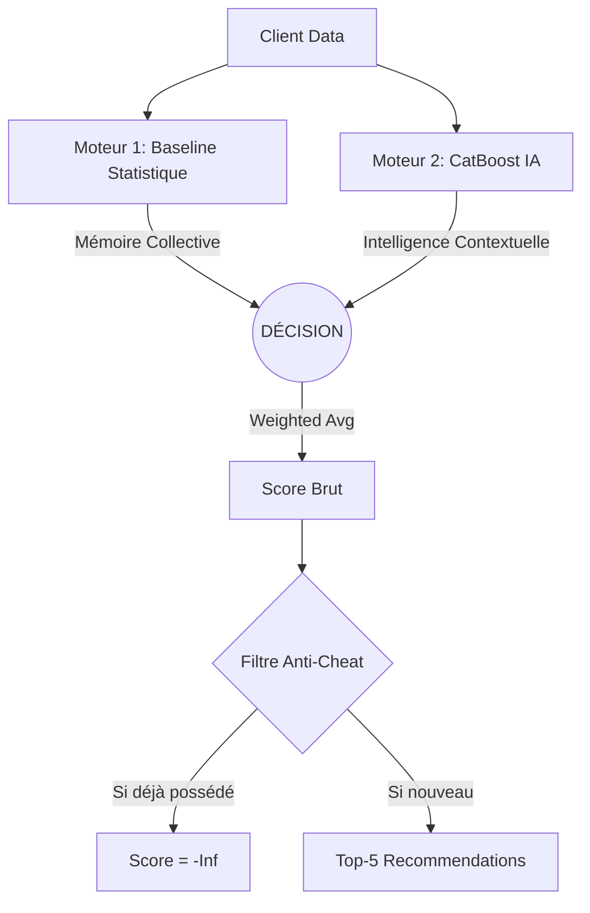

# Système de Recommandation d'Assurance (Zimnat)

**Une approche Hybride (Modèle de Machine Learning + Règles Statistiques) pour l'optimisation du Cross-Sell.**


---

## 1. Contexte Métier & Enjeux

### Le Client : Zimnat Group 🇿🇼
Zimnat est un acteur majeur des services financiers au Zimbabwe, structuré autour de plusieurs pôles stratégiques :
*   **Assurance** : Vie (Life), Non-Vie (Motor, Home), Santé.
*   **Finance** : Microfinance, Gestion de Patrimoine (Wealth Management).

### Le Besoin Business (Pourquoi ce projet ?)
Dans l'assurance, la relation client est précieuse. Contacter un client pour lui proposer un produit qu'il possède déjà est une erreur coûteuse (perte de temps agent, frustration client).
L'objectif est de transformer la démarche commerciale : **passer du "Mass Marketing" au "Precision Marketing".**

**Les Enjeux Stratégiques :**
1.  **Augmentation du Cross-Sell** : Un client multi-équipé (Auto + Maison + Vie) est plus fidèle et plus rentable (LTV élevée).
2.  **Efficacité Opérationnelle** : Fournir aux agents une liste de "Warm Leads" (clients ayant un besoin probabiliste fort) plutôt que d'appeler au hasard.
3.  **Réduction du Churn** : Proposer le bon produit au bon moment renforce la confiance.

---

## 2. Le Challenge Technique (Zindi)

Ce projet répond au challenge **"Zimnat Insurance Recommendation"** (exposé sur Zindi).

### La Problématique "Snapshot"
Contrairement aux sites e-commerce classiques (Amazon/Netflix), nous n'avons pas l'historique temporel des clics ou des achats.
Nous disposons uniquement d'une **photo à l'instant T** du portefeuille client.
> *Question : "Vu que ce client a Profil X et possède déjà {A, B}, quel est le produit C qu'il est le plus susceptible de vouloir ?"*

### La Solution : Compléter le Puzzle
C'est un problème de **Pattern Completion**. Le modèle doit apprendre la "grammaire" des produits d'assurance (ex: "On prend rarement une Assurance Retraite avant d'avoir une Assurance Vie").


```mermaid
graph LR
    A[Profil Client] --> M(Modèle IA)
    B[Portefeuille Actuel] --> M
    M --> P{Prédiction}
    P -->|Score 95%| R1[Produit Manquant A]
    P -->|Score 80%| R2[Produit Manquant B]
```

---

## 3. La Solution : Moteur Hybride ("Dual Engine")

Pour garantir à la fois la performance et la fiabilité, nous avons conçu une architecture à deux têtes.

### Architecture du Système


```mermaid
flowchart TB
    Input[Client Data] --> Stats[Moteur 1: Baseline Statistique]
    Input --> AI[Moteur 2: CatBoost IA]
    
    Stats -- "Mémoire Collective" --> Hybrid((DÉCISION))
    AI -- "Intelligence Contextuelle" --> Hybrid
    
    Hybrid -- "Weighted Avg" --> Final[Score Brut]
    Final --> Rules{Filtre Anti-Cheat}
    Rules -- "Si déjà possédé" --> Reject[Score = -Inf]
    Rules -- "Si nouveau" --> TopK[Top-5 Recommendations]
```

### Moteur 1 : La Mémoire (Baseline Statistique)
*   **Approche** : Probabilités Conditionnelles (Bayésien).
*   **Logique** : *"80% des clients qui ont une assurance Auto ont aussi une assurance Habitation."*
*   **Rôle** : Assure la cohérence de base et la robustesse (ne se trompe jamais sur les grandes tendances).

### Moteur 2 : L'Intelligence (CatBoost)
*   **Approche** : Gradient Boosting sur Arbres de Décision.
*   **Logique** : *"Ce client est jeune, vit en zone urbaine, et a un revenu élevé -> Il a besoin d'une protection Électronique, même si ce n'est pas le produit le plus populaire."*
*   **Rôle** : Apporte la personnalisation fine et détecte les signaux faibles.

### Sécurité "Anti-Cheat"
Une règle métier stricte vient nettoyer la sortie : **Le système ne recommandera JAMAIS un produit déjà détenu.** Cela garantit zéro faux pas commercial.

---

## 4. L'Application Streamlit : Guide des Modules

L'outil est livré sous forme d'une application Web interactive (`app/Home.py`) divisée en 5 modules, conçus pour différents utilisateurs.

### 1. Home (Tableau de Bord Exécutif)
*   **Pour qui ?** : Management / Parties Prenantes.
*   **Quoi ?** : Vue d'ensemble de la performance (KPIs comme le Hit@1), contexte du projet, et proposition de valeur.

### 2. Business Insights (Stratégie)
*   **Pour qui ?** : Analystes Marketing.
*   **Fonction** : Comprendre le marché.
    *   *Saisonnalité* : Quand vend-on le plus ?
    *   *Segmentation* : Qui sont nos clients VIP ("Sleeping Giants") ?
    *   *Performance* : Quelle branche vend le mieux ?

### 3. Client Inspector (Terrain)
*   **Pour qui ?** : Agents d'Assurance.
*   **Fonction** : Préparer un rendez-vous client.
    *   Entrez un ID client -> Obtenez son Top-3 produits.
    *   Comprenez **POURQUOI** (ex: "Recommandé car Age > 40 et Occupation = Enseignant").

### 4. Market Simulator (Laboratoire)
*   **Pour qui ?** : Product Owners.
*   **Fonction** : Tester des hypothèses ("What-If").
    *   *"Si notre clientèle rajeunit de 10 ans, quels produits vont monter ?"*
    *   Permet d'ajuster l'offre avant même de lancer une campagne.

### 5. Methodology (Transparence)
*   **Pour qui ?** : Data Scientists / Auditeurs.
*   **Fonction** : Documentation technique.
    *   Détail du protocole "Hide and Seek" (Leave-One-Out) utilisé pour valider le modèle sans données futures.

---

## 5. Installation & Démarrage

### Pré-requis Technique
*   Python 3.8+
*   Pip

### Installation Rapide
```bash
# 1. Cloner le dépôt
git clone <url-du-repo>
cd insurance_recommender

# 2. Installer les dépendances
pip install -r requirements.txt
```

### Lancer l'Application
```bash
streamlit run app/Home.py
```
Une fois lancé, votre navigateur s'ouvrira automatiquement sur : `http://localhost:8501`.

---

## 6. Extension : DecisionFlow AI & Agentic Layer

Cette nouvelle version du projet n'est plus seulement un moteur de
recommandation.  Elle intègre une **couche décisionnelle** qui
structurera l'ensemble du pipeline d'aide à la décision.

### 6.1 Architecture DecisionFlow

Le module `src/decisionflow` encapsule toute la logique
non‑apprenante :

1. **`schemas.py`** : définit des dataclasses pour représenter un
   profil client, des recommandations, des décisions de politique,
   des explications et des traces d'audit.
2. **`profile_builder.py`** : transforme les données brutes en
   `ClientProfile` standardisé (extraction des produits possédés,
   détection de la qualité des données, inférence d'un segment basique).
3. **`recommendation_context.py`** : appelle le moteur hybride
   existant (baseline + CatBoost) et renvoie des scores bruts
   structurés.
4. **`policy_rules.py`** : applique des règles métier et des
   contraintes réglementaires définies dans `data/product_knowledge/*.yaml`.
5. **`risk_scoring.py`** : calcule des indicateurs de confiance et
   demande une revue manuelle en cas d'incertitude.
6. **`explanation.py`** : génère des explications factuelles à partir
   des données et des règles (sans halluciner de raisons).
7. **`audit.py`** : enregistre chaque recommandation dans un log JSON
   afin d'assurer la traçabilité.
8. **`decision_engine.py`** : orchestre l'ensemble des étapes et
   renvoie un dictionnaire complet prêt à être affiché.

### 6.2 Couche Agentique (optionnelle)

Le répertoire `src/agents` expose des outils (`tools.py`) et des
agents (`manager.py`) pour interfacer la logique déterministe avec des
LLM via la bibliothèque [smolagents](https://github.com/smol-ai/smolagents).
Un **manager** coordonne des sous‑agents spécialisés (recommandation,
risque, explication, audit).  Les agents n'inventent jamais de
données : ils appellent les fonctions déterministes définies dans le
code.

### 6.3 Retrieval & Evaluation

Le sous‑package `src/retrieval` offre une base pour enrichir les
explications avec des descriptions produits (simple recherche par
mots‑clés).  Le sous‑package `src/evaluation` contient des fonctions
d'évaluation (Hit@K, MRR, conformité aux règles, etc.) et un
`eval_runner` pour lancer des évaluations complètes à partir de
datasets de benchmarking.

### 6.4 Nouvelle UI Streamlit

Trois nouvelles pages ont été ajoutées :

* **DecisionFlow AI** (`app/pages/6_DecisionFlow_AI.py`) : lance le
  pipeline complet sur un ID client et affiche les recommandations,
  le niveau de risque et l'explication.
* **Agent Inspector** (`app/pages/7_Agent_Inspector.py`) : permet de
  dialoguer avec le manager agent en langage naturel (si smolagents
  est installé).
* **Evaluation** (`app/pages/8_Evaluation.py`) : exécute des tests
  hors ligne et affiche les métriques.

---

## 7. Dépendances Supplémentaires

Pour activer l'agentic layer et la recherche hybride, installez
également :

```bash
pip install smolagents[toolkit] huggingface_hub litellm sentence-transformers rank-bm25 faiss-cpu pyyaml
```

Ces dépendances sont optionnelles : la partie déterministe du système
fonctionne toujours avec les dépendances de base listées dans
``requirements.txt``.


---

**Auteur** : Goua Beedi

