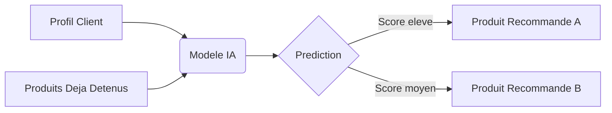
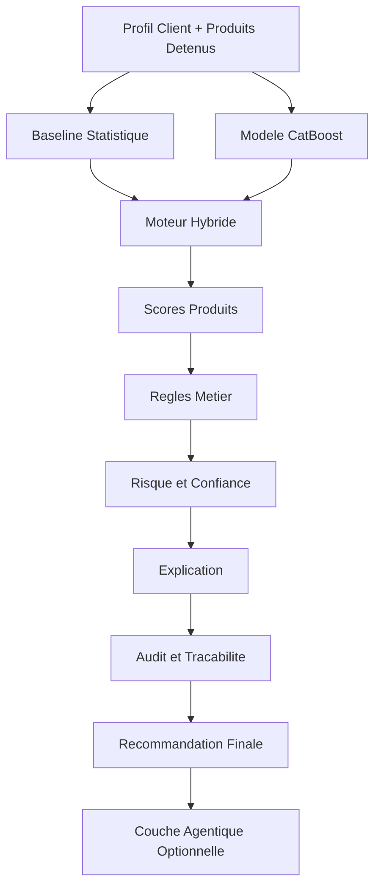
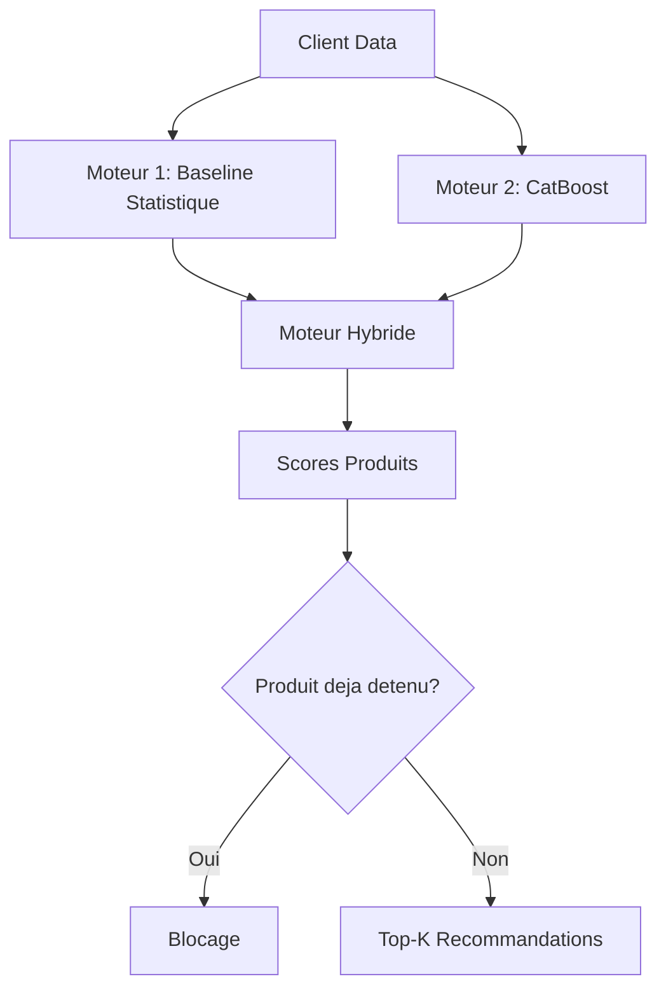
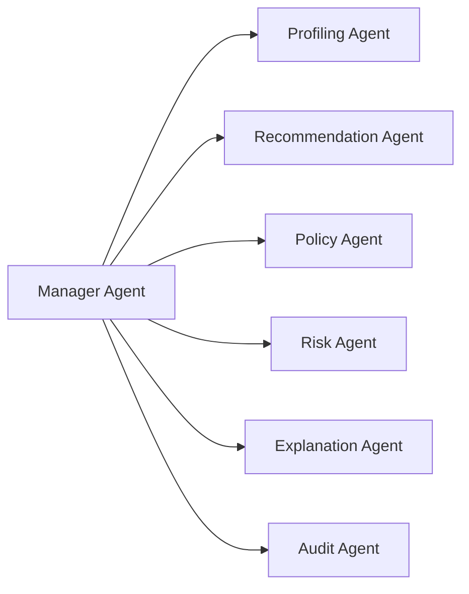

# Insurance Decision AI

Systeme d'aide a la decision assurance combinant moteur hybride de recommandation, regles metier, explication, audit et orchestration agentique.


---

## 1. Contexte Metier et Enjeux

### Le client: Zimnat Group

Zimnat est un acteur important des services financiers au Zimbabwe.
Le groupe propose plusieurs types de produits:

- Assurance Vie
- Assurance Automobile
- Assurance Habitation
- Assurance Sante
- Services financiers complementaires

Le projet vise a ameliorer la maniere dont les produits sont proposes aux clients existants.

### Le besoin metier

Dans une compagnie d'assurance, proposer un produit deja detenu par un client est une mauvaise experience:

- perte de temps pour les agents
- recommandations inutiles
- frustration client
- baisse de confiance dans le systeme

L'objectif est donc de transformer la demarche commerciale:

> passer d'une approche generale a une approche ciblee et personnalisee.

Le systeme doit aider les equipes a identifier:

- quels clients contacter
- quels produits proposer
- avec quel niveau de confiance

### Les enjeux principaux

#### Augmenter le cross-sell

Un client possedant plusieurs produits est generalement:

- plus fidele
- plus rentable
- plus engage

#### Ameliorer l'efficacite commerciale

Le systeme aide les agents a prioriser les clients ayant le plus fort potentiel.

#### Reduire les erreurs commerciales

Le systeme applique des regles empechant les recommandations incoherentes.

---

## 2. Le Defi Technique

Le projet utilise des donnees contenant:

- le profil client
- les produits deja detenus
- des informations demographiques et business

Le defi principal est le suivant:

> A partir du profil d'un client et des produits qu'il possede deja, quel nouveau produit est le plus pertinent a recommander?

Contrairement a certaines plateformes e-commerce, nous ne disposons pas d'un historique complet des comportements utilisateurs.
Le systeme doit donc apprendre les relations entre:

- les profils clients
- les produits deja detenus
- les besoins probables

---

## 3. Intuition du Projet: Completer le Portefeuille Client

Le systeme fonctionne comme un moteur capable de completer intelligemment le portefeuille d'un client.

Exemple:

- un client possede deja une assurance automobile
- possede un profil familial
- possede un revenu stable
- il peut avoir un besoin probable d'assurance habitation ou vie

### Vue simplifiee


```mermaid
graph LR
    A[Profil Client] --> M(Modele IA)
    B[Produits Deja Detenus] --> M
    M --> P{Prediction}
    P -->|Score eleve| R1[Produit Recommande A]
    P -->|Score moyen| R2[Produit Recommande B]
```

Le systeme ne cherche donc pas uniquement a predire un produit populaire.
Il cherche a produire une recommandation coherente avec:

- le profil client
- les produits existants
- les contraintes metier

---

## 4. Architecture du Systeme

Le projet a ete concu comme un systeme complet d'aide a la decision assurance.

L'objectif n'est pas seulement de produire un score, mais une recommandation:

- coherente
- explicable
- tracable
- compatible avec les regles metier

Le systeme combine:

1. un moteur hybride de recommandation
2. une couche de regles metier
3. un module de risque et de confiance
4. une couche d'explication
5. un systeme d'audit
6. une orchestration agentique optionnelle

### Architecture globale


```mermaid
flowchart TB
    Input[Profil Client + Produits Detenus]
    Input --> Stats[Baseline Statistique]
    Input --> ML[Modele CatBoost]
    Stats --> Hybrid[Moteur Hybride]
    ML --> Hybrid
    Hybrid --> Raw[Scores Produits]
    Raw --> Rules[Regles Metier]
    Rules --> Risk[Risque et Confiance]
    Risk --> Explain[Explication]
    Explain --> Audit[Audit et Tracabilite]
    Audit --> Final[Recommandation Finale]
    Final --> Agents[Couche Agentique Optionnelle]
```

---

## 5. Core Recommender Engine

Le coeur du systeme repose sur un moteur hybride combinant:

- statistiques
- machine learning
- regles metier

### 5.1 Moteur Statistique

Le moteur statistique apprend les relations frequentes entre produits.

Exemple:

Les clients possedant une assurance automobile possedent souvent aussi une assurance habitation.

Ce moteur apporte:

- robustesse
- stabilite
- coherence globale

### 5.2 Modele Machine Learning: CatBoost

Le modele CatBoost utilise:

- age
- profession
- situation familiale
- produits detenus
- informations business

Le modele permet de detecter des besoins plus specifiques selon le profil client.

Exemple:

Un jeune actif urbain peut avoir un besoin probable de protection complementaire.

### 5.3 Fusion des Scores

Les deux moteurs sont combines via une moyenne ponderee.

Le moteur statistique apporte:

- la memoire collective
- les tendances globales

CatBoost apporte:

- la personnalisation
- les signaux plus fins

Cette combinaison ameliore:

- la stabilite
- la pertinence
- la robustesse des recommandations

### 5.4 Securite Metier: Anti-erreur

Le systeme ne recommande jamais un produit deja detenu.

Cette regle garantit:

- zero recommandation incoherente
- meilleure qualite commerciale
- meilleure confiance dans le systeme

### Vue du moteur hybride


```mermaid
flowchart TB
    Input[Client Data] --> Stats[Moteur 1: Baseline Statistique]
    Input --> AI[Moteur 2: CatBoost]
    Stats --> Hybrid[Moteur Hybride]
    AI --> Hybrid
    Hybrid --> Final[Scores Produits]
    Final --> Rules{Produit deja detenu?}
    Rules -->|Oui| Reject[Blocage]
    Rules -->|Non| TopK[Top-K Recommandations]
```

---

## 6. Couche Decisionnelle

Les scores produits par le modele ne sont jamais utilises directement.

Une couche decisionnelle applique ensuite:

- les regles metier
- les contraintes d'eligibilite
- les verifications de coherence
- les regles de securite
- les controles de confiance

Le systeme devient ainsi un veritable systeme d'aide a la decision.

### Exemple de regles

Le systeme peut:

- bloquer certains produits selon l'age
- empecher certaines recommandations incoherentes
- demander une validation humaine
- ajouter un niveau de confiance

---

## 7. Explication, Risque et Audit

Chaque recommandation peut etre expliquee.

Le systeme indique:

- pourquoi un produit est recommande
- quels signaux ont influence la decision
- quelles regles ont ete appliquees
- le niveau de confiance associe

### Exemple d'explication

Produit recommande: Assurance Vie

Raisons:

- profil similaire a des clients possedant deja ce produit
- score CatBoost eleve
- produit non deja detenu
- regles metier validees

Limites:

- recommandation probabiliste
- validation humaine possible selon le contexte

### Risque et Confiance

Le systeme calcule egalement:

- un niveau de confiance
- un niveau de risque
- un besoin eventuel de revue humaine

Cela evite de considerer le modele comme un systeme prenant seul les decisions.

### Audit et Tracabilite

Toutes les decisions peuvent etre enregistrees:

- scores modeles
- regles appliquees
- produits bloques
- explications generees
- version des modeles

Cela permet:

- transparence
- suivi
- reproductibilite
- analyse des erreurs

---

## 8. Couche Agentique (Agentic AI)

Le systeme peut egalement etre pilote par des agents IA construits avec SmolAgents.

Les agents ne prennent jamais directement les decisions metier.

Leur role est:

- orchestrer les etapes
- appeler les outils deterministes
- generer des rapports
- expliquer les decisions
- coordonner les validations

### Architecture Agentique


```mermaid
flowchart LR
    Manager[Manager Agent]
    Manager --> Profiling[Profiling Agent]
    Manager --> Recommendation[Recommendation Agent]
    Manager --> Policy[Policy Agent]
    Manager --> Risk[Risk Agent]
    Manager --> Explain[Explanation Agent]
    Manager --> Audit[Audit Agent]
```

### Principe important

Le systeme suit une regle simple:

Les agents orchestrent.
Le moteur deterministe decide.

Les modeles de langage ne modifient jamais:

- les scores
- les regles metier
- les contraintes de securite

---

## 9. Recherche Produit et Contextualisation

Le systeme possede egalement une couche de recherche produit permettant:

- d'enrichir les explications
- de retrouver des informations metier
- d'ajouter du contexte produit

Le projet inclut:

- recherche textuelle
- BM25
- recherche vectorielle
- reranking

Cette couche ameliore:

- la qualite des explications
- la contextualisation
- la pertinence metier

---

## 10. Evaluation du Systeme

Le projet contient plusieurs modules d'evaluation.

### Evaluation des recommandations

Mesures utilisees:

- Hit@K
- MAP@K
- NDCG
- couverture
- diversite

### Evaluation des regles metier

Le systeme verifie:

- qu'aucun produit deja detenu n'est recommande
- que les regles metier sont respectees
- que les produits interdits sont bloques

### Evaluation des agents

Les agents sont evalues sur:

- utilisation correcte des outils
- coherence des etapes
- erreurs de raisonnement
- temps de reponse

---

## 11. Application Streamlit

Le projet est livre avec une application Streamlit interactive.

### Home

Vue d'ensemble du projet:

- objectifs
- performances
- architecture
- indicateurs cles

### Business Insights

Analyse metier:

- segmentation clients
- tendances produits
- analyses marketing

### Client Inspector

Analyse detaillee d'un client:

- produits detenus
- recommandations
- explications
- niveau de confiance

### Market Simulator

Simulation de scenarios metier:

- evolution du profil client
- impact sur les recommandations
- analyse what-if

### Methodology

Documentation technique:

- validation
- strategie d'evaluation
- protocole experimental

### DecisionFlow AI

Execution complete du pipeline decisionnel:

- profil client
- recommandations
- regles appliquees
- risque
- explications
- audit

### Agent Inspector

Interaction avec les agents IA:

- Hugging Face
- Ollama
- orchestration agentique
- traces des outils utilises

### Evaluation

Dashboard d'evaluation:

- qualite des recommandations
- conformite metier
- qualite des explications
- performances agents

---

## 12. Structure du Projet

```text
src/
|-- decisionflow/
|-- agents/
|-- retrieval/
|-- evaluation/
|-- monitoring/
app/
|-- Home.py
|-- pages/
data/
|-- evaluation/
|-- product_knowledge/
tests/
notebooks/
artifacts/
scripts/
```

---

## 13. Installation

Prerequis:

- Python 3.8+
- pip

Installation:

```bash
git clone <repo_url>
cd insurance_recommender
pip install -r requirements.txt
```

Lancer l'application:

```bash
streamlit run app/Home.py
```

Puis ouvrir:

http://localhost:8501

---

## 14. Dependances Optionnelles

Pour activer les agents IA et la recherche avancee:

```bash
pip install smolagents[toolkit]
pip install huggingface_hub
pip install litellm
pip install sentence-transformers
pip install rank-bm25
pip install faiss-cpu
pip install pyyaml
```

---

## 15. Principes de Conception

Le systeme suit plusieurs principes importants:

- architecture deterministe
- separation claire entre ML et regles metier
- explication systematique
- auditabilite
- securite metier
- orchestration controlee des agents IA

---

## 16. Limites Actuelles

Le projet reste une demonstration technique.

Certaines parties peuvent encore etre ameliorees:

- retrieval avance
- donnees temps reel
- monitoring production
- orchestration distribuee
- optimisation des couts agents

---

## 17. Auteur

Goua Beedi
