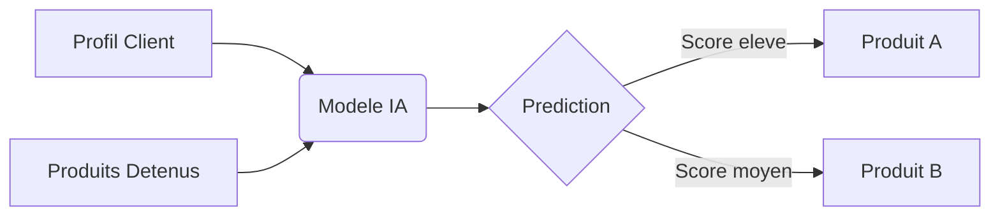
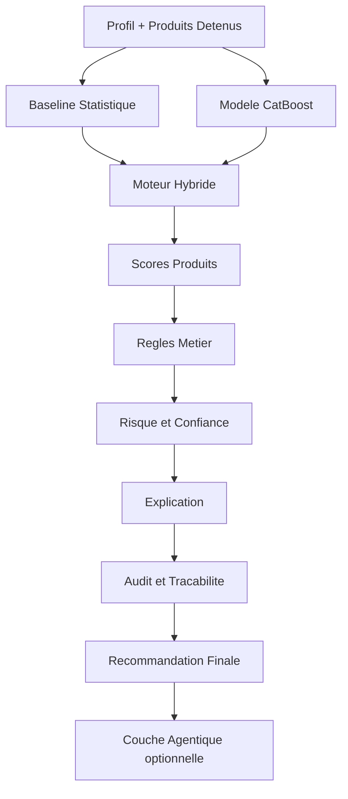
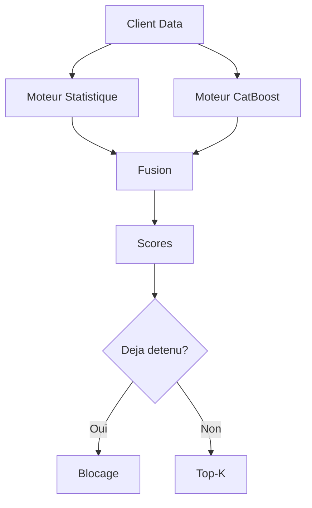
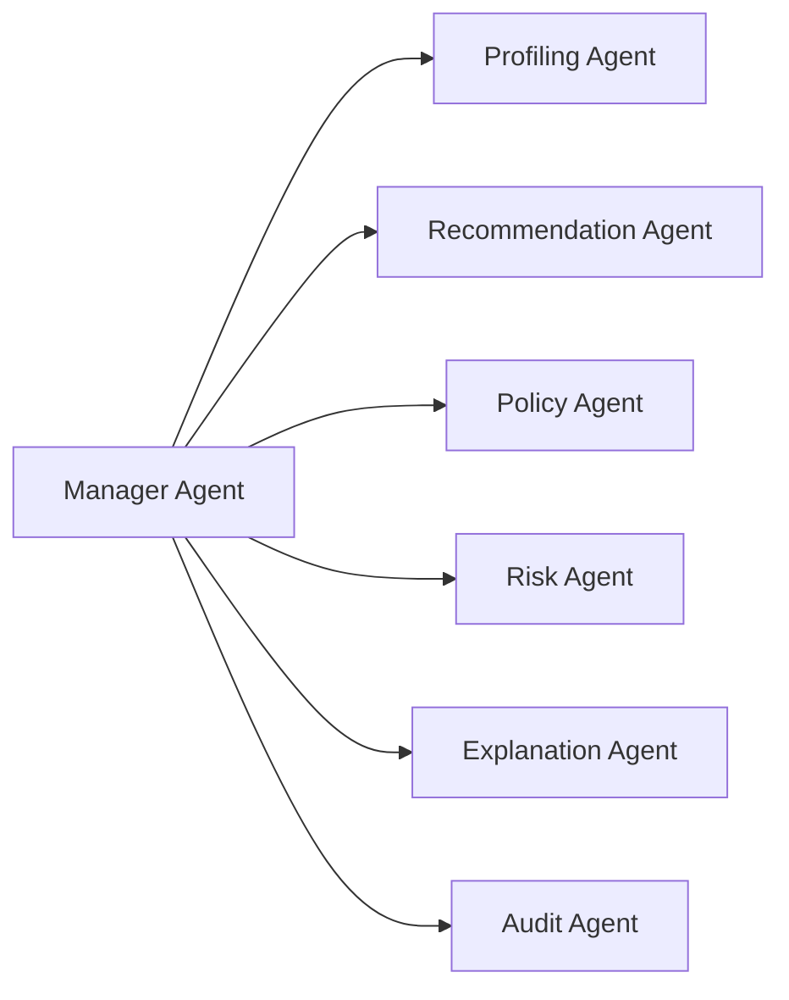

# Guide detaille du projet

Ce document donne la version complete du projet.
Le README reste court pour une lecture rapide, et ce guide garde tous les details.

Lien retour:
- README principal: [../README.md](../README.md)

## 1. Contexte metier et enjeux

### Client

Zimnat Group est un acteur des services financiers au Zimbabwe:
- assurance vie
- assurance automobile
- assurance habitation
- assurance sante
- services financiers complementaires

### Probleme metier

Recommander un produit deja possede cree:
- perte de temps agent
- frustration client
- baisse de confiance

Objectif:
- passer d'une approche generale a une approche ciblee et personnalisee

### Enjeux principaux

- augmenter le cross-sell
- ameliorer l'efficacite commerciale
- reduire les erreurs de recommandation

## 2. Defi technique

Donnees disponibles:
- profil client
- produits deja detenus
- informations demographiques et metier

Question a resoudre:
- quel produit recommander ensuite a ce client?

Contrainte:
- pas d'historique comportemental riche comme en e-commerce

## 3. Intuition produit

Le systeme complete intelligemment le portefeuille client.

Exemple:
- client avec assurance auto + profil familial + revenu stable
- besoin probable: habitation ou vie



## 4. Architecture globale

Le systeme combine:
1. moteur hybride de recommandation
2. couche regles metier
3. module risque et confiance
4. module explication
5. module audit
6. orchestration agentique optionnelle



## 5. Core recommender engine

### 5.1 Baseline statistique

Role:
- apprendre les relations frequentes entre produits
- fournir robustesse et stabilite

### 5.2 CatBoost

Role:
- personnaliser selon le profil client

Exemples de signaux:
- age
- profession
- situation familiale
- produits detenus

### 5.3 Fusion des scores

Combinaison des deux moteurs pour gagner:
- stabilite
- pertinence
- robustesse

### 5.4 Securite metier

Regle dure:
- jamais recommander un produit deja possede



## 6. Couche decisionnelle

Les scores bruts ne sont pas utilises directement.
La couche decisionnelle applique:
- regles metier
- contraintes d'eligibilite
- controles de coherence
- controles de confiance

Exemples:
- blocage par age
- blocage par ineligibilite
- validation humaine si risque eleve

## 7. Explication, risque et audit

### Explication

Le systeme explique:
- pourquoi un produit est recommande
- quels signaux ont pese
- quelles regles ont ete appliquees

### Risque et confiance

Le systeme calcule:
- niveau de confiance
- niveau de risque
- besoin de revue humaine

### Audit

Le systeme trace:
- scores modeles
- regles appliquees
- produits bloques
- explications
- version des modeles

## 8. Couche agentique (optionnelle)

Les agents IA servent a orchestrer, pas a remplacer les regles.

Roles:
- orchestrer les etapes
- appeler les outils deterministes
- produire des rapports

Principe:
- agents orchestrent
- moteur deterministe decide



## 9. Recherche produit et contextualisation

Le projet inclut:
- recherche textuelle
- BM25
- recherche vectorielle
- reranking

But:
- enrichir les explications
- ajouter du contexte metier

## 10. Evaluation du systeme

Mesures cibles:
- Hit@K
- MRR
- MAP@K
- NDCG
- couverture
- diversite

Axes d'evaluation:
- qualite des recommandations
- respect des regles metier
- qualite des explications
- comportement des agents

Point important:
- l'evaluation est la priorite d'amelioration pour prouver la valeur business avec plus de confiance

## 11. Application Streamlit

Pages principales:
- Home
- Business Insights
- Client Inspector
- Market Simulator
- Methodology
- DecisionFlow AI
- Agent Inspector
- Evaluation

## 12. Structure du projet

```text
src/
|-- decisionflow/
|-- agents/
|-- retrieval/
|-- evaluation/
|-- monitoring/
app/
|-- Home.py
|-- pages/
data/
|-- evaluation/
|-- product_knowledge/
artifacts/
notebooks/
scripts/
tests/
```

## 13. Installation et execution

```bash
pip install -r requirements.txt
streamlit run app/Home.py
```

## 14. Dependances optionnelles

```bash
pip install smolagents[toolkit]
pip install huggingface_hub
pip install litellm
pip install sentence-transformers
pip install rank-bm25
pip install faiss-cpu
pip install pyyaml
```

## 15. Principes de conception

- architecture deterministe
- separation claire ML / regles metier
- explication systematique
- auditabilite
- securite metier
- orchestration controlee des agents IA

## 16. Limites actuelles

Le projet est solide en architecture.
Le point principal a renforcer est la preuve d'impact via une evaluation plus robuste.

## 17. Suite recommandee

Pour les prochaines actions:
- [../remarques/prochaines_etapes.md](../remarques/prochaines_etapes.md)

## 18. Auteur

Goua Beedi
